# Chinese Language Learning Platform - Entity Relationship Diagram

This document contains the complete Entity Relationship Diagram (ERD) for the Chinese Language Learning Backend system.

## ERD Overview

The system consists of 16 entities organized into the following domains:
- **User Management**: Users, UserLessonProgress, UserQuestionReview
- **Course Structure**: Courses, Lessons, Content, Question
- **Vocabulary System**: Word, WordSense, WordSenseTranslation, LessonWord
- **Grammar System**: GrammarPattern, GrammarTranslation, LessonGrammarPattern
- **RAG/AI System**: Embedding, RagContext

## Mermaid ERD Diagram

```mermaid
erDiagram
    %% ============================================
    %% USER MANAGEMENT DOMAIN
    %% ============================================

    users {
        int id PK "Auto-increment"
        enum role "Admin/User"
        varchar email UK "Unique, 255 chars"
        varchar passwordHash "255 chars"
        varchar displayName "100 chars, nullable"
        tinyint currentHskLevel "Default: 1, indexed"
        varchar nativeLanguage "10 chars, default: en"
        int totalStudyDays "Default: 0"
        int currentStreak "Default: 0"
        int longestStreak "Default: 0"
        date lastStudyDate "Nullable"
        boolean isActive "Default: true"
        timestamp createdAt
        timestamp updatedAt
    }

    user_lesson_progress {
        int id PK "Auto-increment"
        int userId FK "Indexed with status"
        int lessonId FK "Unique with userId"
        enum status "NOT_STARTED/IN_PROGRESS/COMPLETED"
        decimal scorePercentage "5,2 precision, nullable"
        timestamp completedAt "Nullable"
        timestamp createdAt
        timestamp updatedAt
    }

    user_question_reviews {
        int id PK "Auto-increment"
        int userId FK "Indexed with nextReviewDate"
        int questionId FK "Unique with userId"
        int lessonId FK "Indexed"
        decimal easeFactor "4,2 precision, default: 2.5"
        int interval "Days until next review, default: 1"
        int repetitions "Consecutive correct, default: 0"
        timestamp nextReviewDate "Indexed"
        timestamp lastReviewedAt "Nullable"
        timestamp createdAt
        timestamp updatedAt
    }

    %% ============================================
    %% COURSE STRUCTURE DOMAIN
    %% ============================================

    courses {
        int id PK "Auto-increment"
        enum hskLevel "Indexed"
        varchar title "200 chars"
        text description "Nullable"
        int prerequisiteCourseId FK "Self-referencing, nullable"
        boolean isActive "Default: true"
        int orderIndex "Indexed"
        timestamp createdAt
    }

    lessons {
        int id PK "Auto-increment"
        varchar name "200 chars"
        text description "Nullable"
        boolean isActive "Default: true"
        int orderIndex
        int courseId FK
    }

    contents {
        int id PK "Auto-increment"
        int lessonId FK
        int orderIndex
        enum type "ContentType"
        json data "Flexible content storage"
        boolean isActive "Default: true"
    }

    questions {
        int id PK "Auto-increment"
        int lessonId FK
        int orderIndex
        enum questionType "QuestionType"
        json data "Question data and options"
        boolean isActive "Default: true"
    }

    %% ============================================
    %% VOCABULARY DOMAIN
    %% ============================================

    words {
        int id PK "Auto-increment"
        varchar simplified UK "50 chars, unique indexed"
        varchar traditional "50 chars, nullable"
        timestamp createdAt
    }

    word_senses {
        int id PK "Auto-increment"
        int wordId FK "Unique with senseNumber"
        int senseNumber "Unique with wordId"
        varchar pinyin "100 chars"
        varchar partOfSpeech "20 chars, nullable"
        int hskLevel "Nullable, indexed"
        boolean isPrimary "Default: false"
        varchar imageUrl "500 chars, nullable"
        varchar audioUrl "500 chars, nullable"
    }

    word_sense_translations {
        int id PK "Auto-increment"
        int wordSenseId FK "Unique with language"
        varchar language "5 chars, default: vn"
        text translation
        text additionalDetail "Nullable"
    }

    lesson_words {
        int id PK "Auto-increment"
        int lessonId FK "Unique with wordSenseId"
        int wordSenseId FK
        int orderIndex "Indexed with lessonId"
    }

    %% ============================================
    %% GRAMMAR DOMAIN
    %% ============================================

    grammar_patterns {
        int id PK "Auto-increment"
        json pattern "Array of strings"
        json patternPinyin "Array of strings, nullable"
        varchar patternFormula "200 chars, nullable"
        int hskLevel "Nullable, indexed"
        timestamp createdAt
    }

    grammar_translations {
        int id PK "Auto-increment"
        int grammarPatternId FK "Unique with language"
        varchar language "5 chars"
        varchar grammarPoint "200 chars"
        text explanation
        json example "Nullable"
    }

    lesson_grammar_patterns {
        int id PK "Auto-increment"
        int lessonId FK "Unique with grammarPatternId"
        int grammarPatternId FK
        int orderIndex "Indexed with lessonId"
    }

    %% ============================================
    %% RAG/AI DOMAIN
    %% ============================================

    embeddings {
        int id PK "Auto-increment"
        enum sourceType "WORD/GRAMMAR/CONTENT/QUESTION"
        int sourceId "Polymorphic, indexed with sourceType"
        text contentText
        json embedding "1024 dimensions for bge-m3"
        json metadata "Nullable"
        boolean isActive "Default: true"
        timestamp createdAt
        timestamp updatedAt
    }

    rag_contexts {
        int id PK "Auto-increment"
        int userId FK "Nullable"
        text query
        text response "Nullable"
        json retrievedSources "Array of sources with similarity"
        int processingTimeMs "Nullable"
        timestamp createdAt
    }

    %% ============================================
    %% RELATIONSHIPS
    %% ============================================

    %% User Relationships
    users ||--o{ user_lesson_progress : "tracks progress"
    users ||--o{ user_question_reviews : "reviews questions"
    users ||--o{ rag_contexts : "generates queries"

    %% Course Structure Relationships
    courses ||--o| courses : "has prerequisite"
    courses ||--o{ lessons : "contains"
    lessons ||--o{ contents : "has content"
    lessons ||--o{ questions : "has questions"
    lessons ||--o{ user_lesson_progress : "tracked by users"
    lessons ||--o{ user_question_reviews : "contains reviewed questions"
    lessons ||--o{ lesson_words : "includes vocabulary"
    lessons ||--o{ lesson_grammar_patterns : "teaches grammar"

    %% Vocabulary Relationships
    words ||--o{ word_senses : "has senses"
    word_senses ||--o{ word_sense_translations : "translated to"
    word_senses ||--o{ lesson_words : "used in lessons"

    %% Grammar Relationships
    grammar_patterns ||--o{ grammar_translations : "translated to"
    grammar_patterns ||--o{ lesson_grammar_patterns : "taught in lessons"

    %% Question Relationships
    questions ||--o{ user_question_reviews : "reviewed by users"
```

## Entity Descriptions

### User Management Domain

**users**: Core user entity with authentication, HSK level tracking, and study streak management.

**user_lesson_progress**: Tracks user progress through lessons with completion status and scores. Implements unique constraint on (userId, lessonId).

**user_question_reviews**: Spaced Repetition System (SRS) using SM-2 algorithm. Tracks ease factor, intervals, and next review dates for personalized learning.

### Course Structure Domain

**courses**: Top-level course organization with HSK levels and optional prerequisites. Self-referencing for course dependencies.

**lessons**: Individual lessons within courses with ordering and activation status.

**contents**: Flexible content blocks using JSON storage for various content types (text, dialogue, vocabulary lists, etc.).

**questions**: Interactive questions with JSON-based data structure supporting multiple question types (multiple choice, fill-in-blank, etc.).

### Vocabulary Domain

**words**: Chinese words with simplified and traditional forms. Simplified form is unique indexed.

**word_senses**: Multiple meanings/senses per word with pinyin, HSK level, and media URLs. Composite unique key on (wordId, senseNumber).

**word_sense_translations**: Multi-language translations for each word sense. Default language is Vietnamese ('vn').

**lesson_words**: Junction table linking lessons to specific word senses with explicit ordering.

### Grammar Domain

**grammar_patterns**: Grammar patterns stored as JSON arrays with optional pinyin and formula representations.

**grammar_translations**: Multi-language explanations and examples for grammar patterns.

**lesson_grammar_patterns**: Junction table linking lessons to grammar patterns with ordering.

### RAG/AI Domain

**embeddings**: Vector embeddings (1024-dimensional) for RAG system. Uses polymorphic association via (sourceType, sourceId) to reference words, grammar, content, or questions.

**rag_contexts**: Stores RAG query history with retrieved sources, responses, and performance metrics. Nullable user association for anonymous queries.

## Key Design Patterns

1. **Hierarchical Learning Structure**: Courses → Lessons → Content/Questions
2. **Multi-language Support**: Separate translation tables for vocabulary and grammar
3. **Ordered Collections**: All list-like relationships use orderIndex for explicit ordering
4. **Flexible Content**: JSON columns enable schema-less content storage
5. **Spaced Repetition**: SM-2 algorithm implementation for optimal learning intervals
6. **Polymorphic Embeddings**: Single embedding table for all content types via discriminator
7. **Cascade Deletions**: Referential integrity maintained through cascade delete constraints
8. **Study Analytics**: Comprehensive tracking of streaks, progress, and review history

## Indexes

Key indexes for performance:
- `users.currentHskLevel`: For level-based filtering
- `user_lesson_progress.(userId, status)`: For progress queries
- `user_question_reviews.(userId, nextReviewDate)`: For SRS review scheduling
- `courses.(hskLevel, orderIndex)`: For course listings
- `word_senses.hskLevel`: For vocabulary filtering
- `grammar_patterns.hskLevel`: For grammar filtering
- `embeddings.(sourceType, sourceId)`: For RAG retrieval
- `words.simplified`: For word lookups

## Unique Constraints

- `users.email`: One account per email
- `words.simplified`: One word entry per simplified form
- `(user_lesson_progress.userId, user_lesson_progress.lessonId)`: One progress record per user per lesson
- `(user_question_reviews.userId, user_question_reviews.questionId)`: One review record per user per question
- `(word_senses.wordId, word_senses.senseNumber)`: Numbered senses per word
- `(word_sense_translations.wordSenseId, word_sense_translations.language)`: One translation per language per sense
- `(grammar_translations.grammarPatternId, grammar_translations.language)`: One translation per language per pattern
- `(lesson_words.lessonId, lesson_words.wordSenseId)`: Each word sense appears once per lesson
- `(lesson_grammar_patterns.lessonId, lesson_grammar_patterns.grammarPatternId)`: Each grammar pattern appears once per lesson
